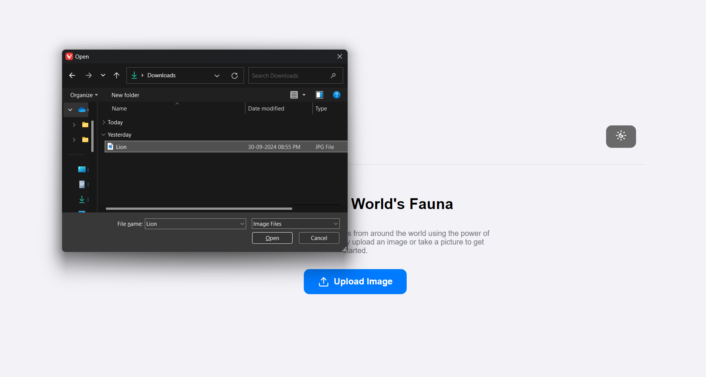
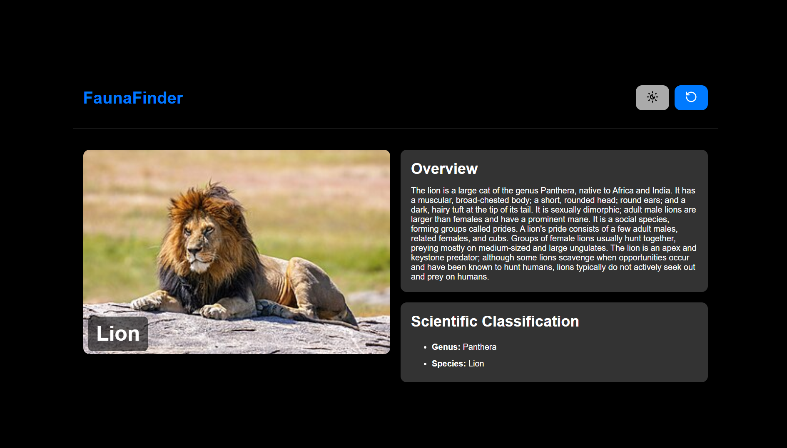
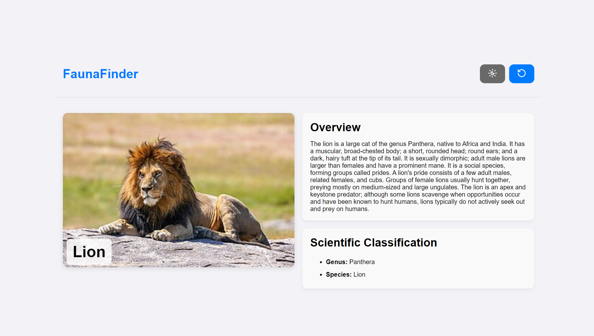
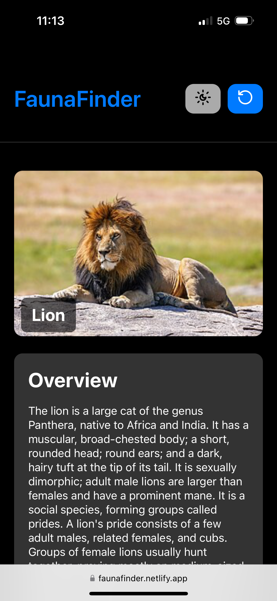
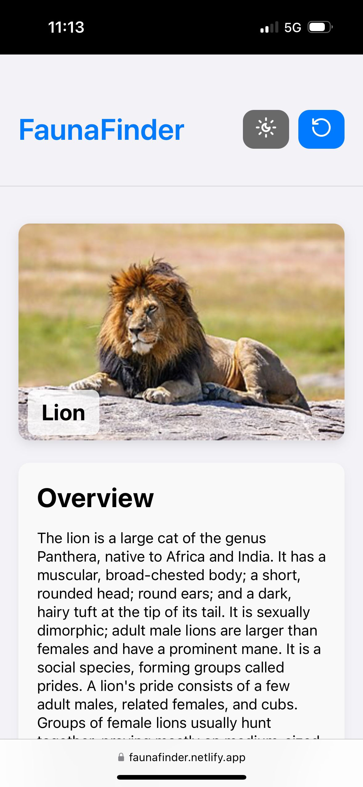

# FaunaFinder

**FaunaFinder** is a web application that allows users to easily identify various animal and bird species by uploading photos. Utilizing advanced web scraping techniques and TensorFlow models, FaunaFinder aims to provide accurate species identification with an intuitive user interface for both mobile and desktop users.

## Table of Contents

- [Features](#features)
- [User Interface](#user-interface)
- [Contributing](#contributing)

## Features

- Upload photos of animals or birds for identification.
- Displays species details scraped from Wikipedia.
- Option to recalibrate species identification using a TensorFlow model.
- Responsive design for seamless use on mobile and desktop devices.

## User Interface

<b>Desktop View</b>

    
<b>Mobile View</b>

    
    

    
    

    
    

## Contributing

Contributions are welcome! If you have suggestions for improvements, please fork the repository and create a pull request.
